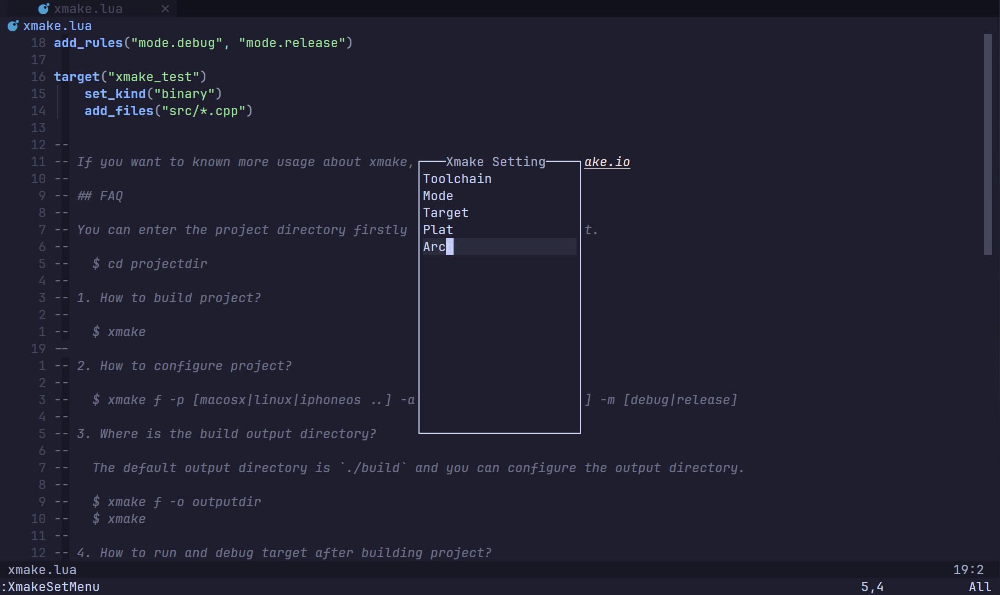
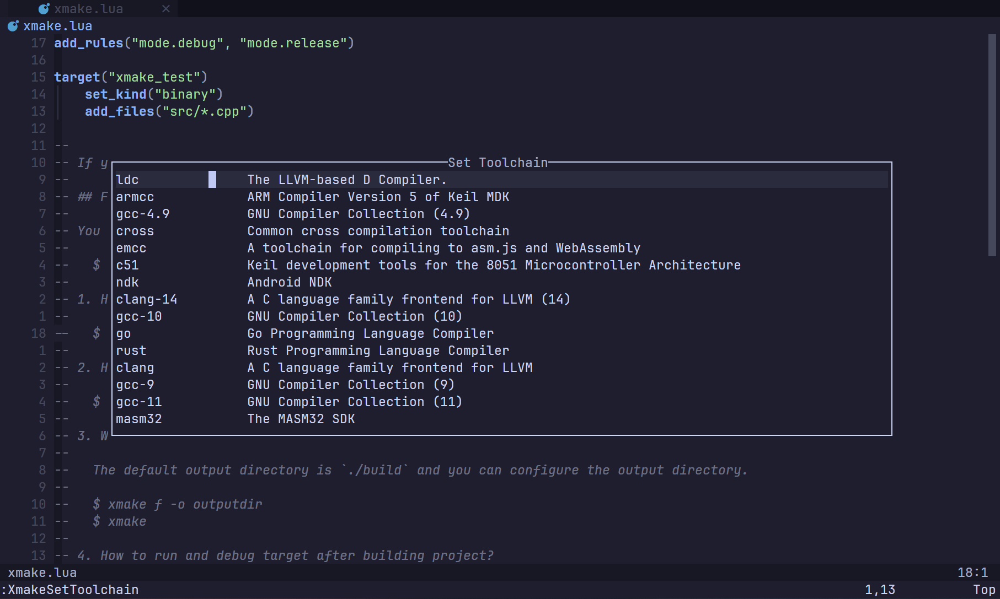
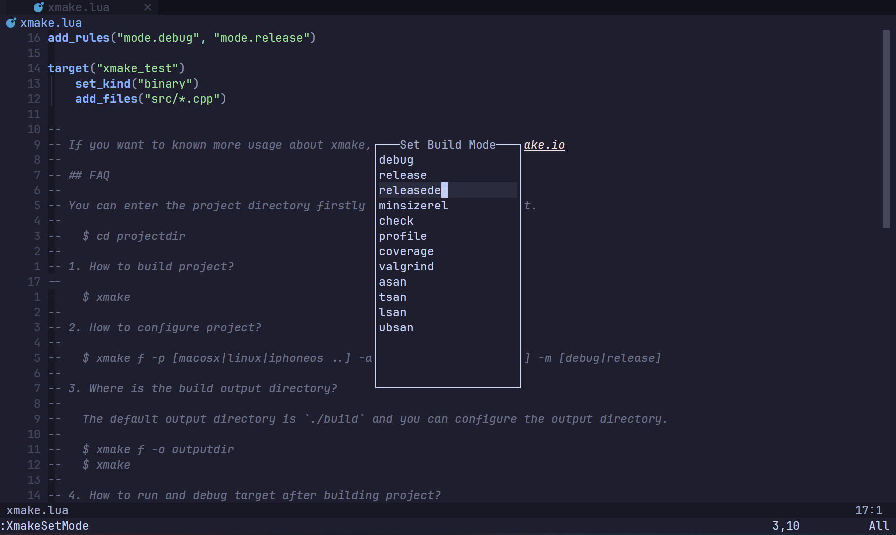
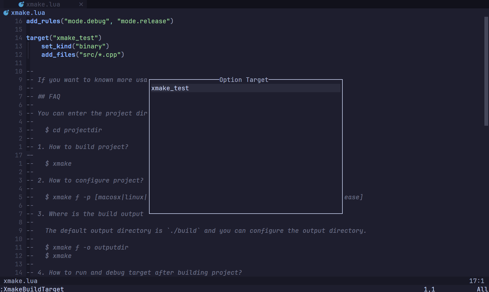

**| English | [简体中文](README.md) |**

# xmake.nvim

This plugin utilizes `nui.nvim` to provide selections that allow you to quickly configure, build, and clean with xmake.
It also generates automatically upon saving the `xmake.lua` file.

<table>
  <tr>
    <th>Set Menu</th>
    <th>Set Toolchain</th>
  </tr>
  <tr>
    <td>
      
    </td>
    <td>
      
    </td>
  </tr>
  <tr>
    <th>Set Build Mode</th>
    <th>Build Target</th>
  </tr>
  <tr>
    <td>
      
    </td>
    <td>
      
    </td>
  </tr>
</table>

# Installation

[lazy.nvim](https://github.com/folke/lazy.nvim):

```lua
{
    "Mythos-404/xmake.nvim"
    lazy = true,
    event = "BufReadPost xmake.lua",
    config = true,
    dependencies = { "MunifTanjim/nui.nvim" },
}
```

## Default Configuration

```lua
{
	compile_commands_dir = ".vscode",
}
```

## Commands

1. `XmakeSetMenu` Overall selection menu
2. `XmakeSetToolchain` Toolchain selection
3. `XmakeSetMode` Compilation mode selection
4. `XmakeSetTarget` Target selection
5. `XmakeSetPlat` Target platform selection
6. `XmakeSetArch` Target architecture selection
7. `XmakeBuild` Build target
8. `XmakeBuildAll` Build all targets
9. `XmakeBuildTarget` Build specified target
10. `XmakeClean` Clean target
11. `XmakeCleanAll` Clean all targets
12. `XmakeCleanTarget` Clean specified target

## Similar Projects

- [CnsMaple/xmake.nvim](https://github.com/CnsMaple/xmake.nvim)
