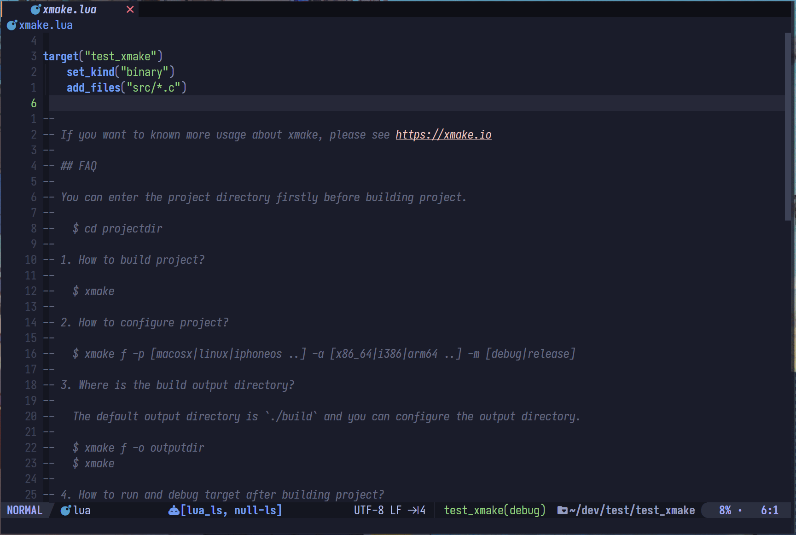

<p align="right"><b>| <a href="README.md">English</a> | 简体中文 |</b></p>

<h1 align="center">
    Xmake.nvim
</h1>

## 🎐 特征

1. 提供UI界面让你可以快速进行xmake配置、编译、清理
2. 在保存`xmake.lua`文件时自动生成*lsp*使用的`compile_commands.json`
3. 所有外部命令调用采用异步的方式执行无需担心性能问题

<table>
  <tr>
    <th>Set Menu</th>
    <th>Set Toolchain</th>
  </tr>
  <tr>
    <td>
      
    </td>
    <td>
      
    </td>
  </tr>
  <tr>
    <th>Set Build Mode</th>
    <th>Build Target</th>
  </tr>
  <tr>
    <td>
      
    </td>
    <td>
      
    </td>
  </tr>
</table>

<details> <summary>Gif 预览</summary>



</details>

# 🏗 安装

### [💤lazy.nvim](https://github.com/folke/lazy.nvim):

```lua
{
    "Mythos-404/xmake.nvim"
    lazy = true,
    event = "BufReadPost xmake.lua",
    config = true,
    dependencies = { "MunifTanjim/nui.nvim", "nvim-lua/plenary.nvim" },
}
```

> 该插件使用新的命令执行函数`vim.system`因此您的*neovim*版本必须为该[提交](https://github.com/neovim/neovim/pull/23827)后构建的
> 如果不支持该函数可以使用v1分支的 [xmake.nvim](https://github.com/Mythos-404/xmake.nvim/tree/v1)

## ⚙️ 默认设置

```lua
{
    files_path = vim.fn.stdpath("cache") .. "/xmake_", -- 插件保存的项目数据

    compile_command = { -- compile_command 文件生成配置
        lsp = "clangd", -- 生成供哪个 lsp 读取的 compile_commands 文件
        dir = ".vscode", -- 生成的的位置
    },

    menu = { -- 界面配置
        size = { width = 25, height = 20 }, -- 界面大小
        bottom_text_format = "%s(%s)", -- 界面格式化字符串 默认生成: `"xmake_test(debug)"`
        border_style = { "╭", "─", "╮", "│", "╯", "─", "╰", "│" }, -- 界面边框详细请看 nui.nvim 文档
    },

    debug = false, -- 开启后提供更详细报错输出

    work_dir = vim.fn.getcwd(), -- 获取工作目录
})
```

## 💡 命令

1. `XmakeSetMenu` 总选择页面
2. `XmakeSetToolchain` 工具链选择
3. `XmakeSetMode` 编译模式选择
4. `XmakeSetTarget` 目标选择
5. `XmakeSetPlat` 目标平台选择
6. `XmakeSetArch` 目标架构选择
7. `XmakeBuild` 编译目标
8. `XmakeBuildAll` 编译全部目标
9. `XmakeBuildTarget` 编译指定目标
10. `XmakeClean` 清理目标
11. `XmakeCleanAll` 清理全部目标
12. `XmakeCleanTarget` 清理指定目标

## ✨ 和其它插件一起使用

和`nvim-dap`一起使用可以获取目标的编译输出路径

```lua
dap.configurations.cpp = {
     {
        name = "Launch file",
        type = "codelldb",
        request = "launch",
        program = function()
            return require("xmake.project_config").info.target.exec_path
        end,
        cwd = "${workspaceFolder}",
        stopOnEntry = false,
    },
}
```

和`lualine.nvim`等状态线插件使用，这里提供`lualine.nvim`的示例

```lua
local xmake_component = {
    function()
        local xmake = require("xmake.project_config").info
        if xmake.target.tg == "" then
            return ""
        end
        return xmake.target.tg .. "(" .. xmake.mode .. ")"
    end,

    cond = function()
        return vim.o.columns > 100
    end,

    on_click = function()
        require("xmake.project_config._menu").init() -- 添加点击后显示的ui
    end,
}

require("lualine").setup({
    sections = {
       lualine_y = {
            xmake_component
        }
    }
})
```

## Todo

- [ ] 运行功能(在UI中)
  - [ ] 运行目标
  - [ ] 运行多个目标
  - [ ] 运行时可以输入
  - [ ] 监控运行是否成功

## 🎉 其他类似项目

- [CnsMaple/xmake.nvim](https://github.com/CnsMaple/xmake.nvim)
